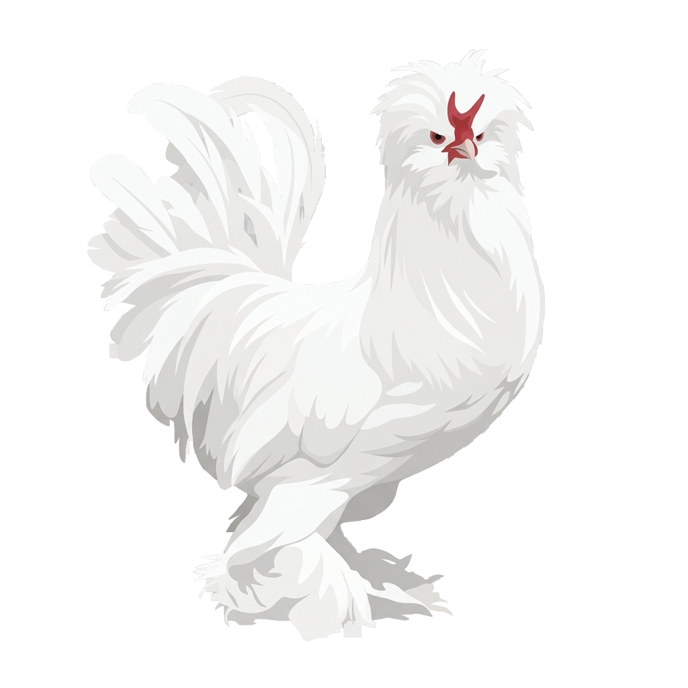

# CAPACITOR_APK_REHBERI.md

Bu dosya, tek dosyalık HTML+JS (Supabase backend'li) web uygulamalarını **Capacitor** ile Android APK'ya çevirme sürecini adım adım anlatır. Kamil'in Türbedar projesinde uygulanan gerçek akıştır; başka projelerde (soyağacı, beekeeping app, vb.) de aynen tekrarlanır. Claude Code bu dosyayı okuyunca sıfırdan anlatılmasına gerek kalmadan bu işe hakim olur.

**Kapsam:** Bu, tek bir projeye özel değil — genel bir oyun kitabıdır (playbook). Her proje kendi `CLAUDE.md` dosyasında iş mantığını, veritabanı şemasını anlatır; bu dosya ise "HTML → APK" mekaniğini anlatır. İkisi birlikte okunur.

---

## 1. Temel yaklaşım: Kabuk APK (Shell APK)

İki yol var, biz her zaman **kabuk APK**'yı seçiyoruz:

- **Kabuk APK (tercih edilen):** `capacitor.config.json` içindeki `server.url`, GitHub Pages (veya benzeri) adresine bakar. APK sadece boş bir kabuktur; her açılışta web sitesini yükler. **GitHub'a commit atınca bütün telefonlar otomatik güncellenir**, yeni APK dağıtmaya gerek yok.
- **Gömülü sürüm (alternatif, sadece Play Store'a gidilecekse):** Dosyalar APK'nın içine gömülür, her güncellemede yeni APK derlenip dağıtılması gerekir. Play Store bazen kabuk APK'yı sevmeyebilir; mağazaya gidilecekse bu yola geçilir.

Varsayılan: **kabuk APK**. Kullanıcı özellikle "Play Store'a koyacağım, gömülü olsun" demedikçe bunu değiştirme.

---

## 2. Kurulum adımları (Windows + Android Studio)

Kullanıcının bilgisayarında **Android Studio kurulu olmalı** (ücretsiz, ayrı indirilir). Sıra:

```powershell
mkdir proje-app
cd proje-app
npm init -y
npm install @capacitor/core @capacitor/cli @capacitor/android
```

`npx cap init --name "..." --web-dir www` çoğu zaman `--name` bayrağını desteklemez (sürüme göre değişir) — hata verirse atla, `capacitor.config.json`'ı elle yaz (bkz. §3).

```powershell
npx cap add android
```

Bu komut `android/` klasörünü oluşturur — bu Android Studio projesinin kendisidir.

**Sık karşılaşılan hatalar:**
- `error: unknown option '--name'` → bu bayrağı kullanma, `cap init`'i parametresiz çalıştır veya atla, config dosyasını elle düzenle.
- `Configuring project ':capacitor-android' without an existing directory is not allowed` → `node_modules` bozuk kurulmuş demektir. Çözüm: `node_modules` klasörünü ve `package-lock.json`'ı sil, `npm install` ve Capacitor paketlerini yeniden kur, `npx cap sync android` çalıştır.
- `getDefaultProguardFile('proguard-android.txt') is no longer supported` → `android/app/build.gradle` içinde `proguard-android.txt` yazan satırı `proguard-android-optimize.txt` yap.

---

## 3. capacitor.config.json (şablon)

Proje kökünde bu dosyayı oluştur/düzenle (mevcut içeriği komple değiştir):

```json
{
  "appId": "com.KULLANICI.PROJEADI",
  "appName": "Proje Adı",
  "webDir": "www",
  "server": {
    "url": "https://KULLANICI.github.io/PROJEADI/",
    "androidScheme": "https",
    "allowNavigation": [
      "KULLANICI.github.io",
      "*.supabase.co",
      "*.openstreetmap.org",
      "*.tile.openstreetmap.org",
      "nominatim.openstreetmap.org",
      "fonts.googleapis.com",
      "fonts.gstatic.com",
      "cdnjs.cloudflare.com",
      "cdn.jsdelivr.net",
      "accounts.google.com",
      "*.arcgisonline.com"
    ]
  },
  "android": {
    "allowMixedContent": false,
    "backgroundColor": "#F7F0E6"
  }
}
```

`allowNavigation` listesine projenin kullandığı her CDN/API alan adı eklenmeli — yoksa o kaynak WebView içinde engellenebilir. `backgroundColor` uygulamanın kendi tema rengine göre ayarlanır (bkz. logo/tasarım dosyası).

**www klasörü zorunlu:** Capacitor `webDir` bekler, boş olamaz. İçine çevrimdışı/yedek bir `index.html` konur (internet yokken görünecek basit bir sayfa — "bağlantını kontrol et" mesajı yeterli).

---

## 4. Uygulama simgesi (launcher icon)

Android 5 farklı yoğunlukta (mdpi/hdpi/xhdpi/xxhdpi/xxxhdpi) hem kare hem yuvarlak ikon ister. İki yöntem:

**A) Android Studio'nun kendi aracı (varsa):** `app/src/main/res` klasörüne sağ tık → **New → Image Asset** → Foreground'a logo PNG'sini seç, Background'a marka rengini gir (hex) → Next → Finish. Bazı Android Studio sürümlerinde bu menü farklı yerde olabilir; yoksa B yöntemine geç.

**B) Elle üretip kopyalama (garanti yöntem, Claude tarafında yapılır):**
```python
from PIL import Image, ImageDraw
import os

logo = Image.open('logo.png').convert('RGBA')  # şeffaf, kare olmayabilir
g, y = logo.size

def ic_olustur(boyut, padding_oran=0.18, zemin=(247,240,230,255)):
    kare = Image.new('RGBA', (boyut, boyut), zemin)
    ic_boyut = int(boyut * (1 - padding_oran * 2))
    oran = min(ic_boyut / g, ic_boyut / y)
    yg, yy = int(g*oran), int(y*oran)
    kucuk = logo.resize((yg, yy), Image.LANCZOS)
    kare.paste(kucuk, ((boyut-yg)//2, (boyut-yy)//2), kucuk)
    return kare.convert('RGB')

def yuvarlak_olustur(boyut, zemin=(247,240,230,255)):
    kare = ic_olustur(boyut, 0.22, zemin).convert('RGBA')
    mask = Image.new('L', (boyut, boyut), 0)
    ImageDraw.Draw(mask).ellipse([0,0,boyut-1,boyut-1], fill=255)
    kare.putalpha(mask)
    return kare

boyutlar = {'mipmap-mdpi':48, 'mipmap-hdpi':72, 'mipmap-xhdpi':96, 'mipmap-xxhdpi':144, 'mipmap-xxxhdpi':192}
for klasor, boyut in boyutlar.items():
    os.makedirs(klasor, exist_ok=True)
    ic_olustur(boyut).save(f'{klasor}/ic_launcher.png')
    yuvarlak_olustur(boyut).save(f'{klasor}/ic_launcher_round.png')

ic_olustur(512, 0.12).save('ic_launcher-playstore.png')  # Play Store listeleme ikonu
```

Kullanıcıya ZIP olarak ver; her `mipmap-*` klasörünün içeriğini `android/app/src/main/res/mipmap-*/` altına (var olanların üzerine) kopyalamasını söyle. `ic_launcher-playstore.png`'yi ayrıca saklasın — mağaza listelemesinde lazım olur.

**Zemin rengi** her zaman projenin marka krem/arka plan rengiyle eşleşmeli (logo şeffafsa arkası bu renk olur).

---

## 5. GitHub için logolu README

Her projede depo kök dizinine iki dosya konur: **`README.md`** ve **`logo.png`** (kare olması şart değil, düz/şeffaf logo yeterli). README'nin amacı programatik detaya boğmadan projenin **ne olduğunu ve nasıl çalıştığını** yeni birine anlatmaktır — kod içi belgeleme değildir.

### Şablon yapı

```markdown
<div align="center">



# PROJE ADI

**Slogan (varsa)**

_Bir cümlelik açıklama_

[**▶ Uygulamayı Aç**](https://KULLANICI.github.io/PROJEADI/)

</div>

---

## PROJE ADI nedir?

(2-3 paragraf: ne işe yarar, kimin için, neden var. Programatik detay YOK —
"tek dosya HTML" gibi teknik ayrıntılar buraya değil Teknoloji bölümüne gider.)

## Nasıl çalışır?

(Kullanıcının gözünden adım adım akış — 3-5 madde, numaralı liste.
Örn: Keşfet → Ekle → Onay → Zenginleştir gibi.)

## Öne çıkan özellikler

(Emoji + kalın başlık + kısa açıklama listesi. Özellik adı kullanıcı diliyle,
"RLS politikası" gibi teknik terimler yok — "Onay sistemi" yeterli.)

## Teknoloji

(TEK KISA PARAGRAF: hangi backend, hangi harita/grafik kütüphanesi, nasıl
yayınlanıyor, mobil versiyon var mı. Link'lerle: [Supabase](https://...) gibi.
Burası da mimari şeması değil, meraklısı için 3-4 cümle.)

## Sürüm Geçmişi

| Sürüm | Öne çıkanlar |
|-------|--------------|
| **X.Y** | Bir cümlelik özet |
| ... | (en yeniden eskiye sıralı, her satır TEK cümle) |

## Katkı

(Nasıl katkıda bulunulur — genelde "uygulamaya gir, hesabınla katıl" kadar basit.)

---

<div align="center">
<sub>Kapanış imzası / slogan tekrarı</sub>
</div>
```

### Kurallar

- **Programatik detaya girme.** Tablo adı, fonksiyon adı, RLS politikası, dosya yapısı README'ye YAZILMAZ — onlar `CLAUDE.md`'nin işidir. README, projeyi hiç tanımayan bir insana "bu ne, ne işe yarar, nasıl kullanılır" anlatır.
- **Logo `` etiketiyle**, base64 gömülü değil — README'yi şişirmez, GitHub'da düzgün render olur. Dosya adı (`logo.png`) ile `src` birebir eşleşmeli; `assets/` gibi bir alt klasöre konursa yol da öyle güncellenir.
- **Sürüm tablosu her yeni sürümde güncellenir** — en üste yeni satır eklenir, satır başına tek cümlelik özet (uzun paragraf yazılmaz).
- **Uzunluk:** README bir oturumda okunacak kadar kısa kalmalı — 100-150 satırı geçmemeli. Detay isteyenler zaten kodu okur.

### Logo hazırlama (README için)

Logonun README'de iyi görünen boyutu genelde 200-280px genişlik. Eğer orijinal logo şeffaf değilse veya çok büyükse:

```python
from PIL import Image
im = Image.open('logo-orijinal.png')
g, y = im.size
hedef_genislik = 280
im.resize((hedef_genislik, round(y * hedef_genislik / g)), Image.LANCZOS).save('logo.png', optimize=True)
```

Logoyu uygulama simgesi üretiminde kullanılan aynı şeffaf/temizlenmiş sürümden türetmek tutarlılık sağlar (bkz. §4 — Uygulama simgesi, aynı `logo.png` kaynağı).

---

## 6. Gezinme çubuğu (navigation bar) temalandırma

Android'in alt sistem çubuğu (geri/ana ekran/son uygulamalar) varsayılan olarak siyah/koyu kalır ve uygulamanın tasarımıyla uyumsuz durur. Düzeltme iki katmanlı olmalı çünkü XML tabanlı tema bazı Capacitor sürümlerinde etkisiz kalabiliyor:

**A) `android/app/src/main/res/values/styles.xml`** içine (API 27 altını da kapsayacak minimum satır):
```xml
<item name="android:navigationBarColor">#FFFCF5</item>
```

**B) `android/app/src/main/res/values-v27/styles.xml`** (yeni dosya, API 27+ için tam özellikli):
```xml
<?xml version="1.0" encoding="utf-8"?>
<resources>
    <style name="AppTheme" parent="Theme.AppCompat.Light.DarkActionBar">
        <item name="android:navigationBarColor">#FFFCF5</item>
        <item name="android:navigationBarDividerColor">#E3D9C3</item>
        <item name="android:windowLightNavigationBar">true</item>
    </style>
</resources>
```
(`navigationBarDividerColor` API 27 altında derleme hatası verir — bu yüzden ayrı `values-v27` klasöründe.)

**C) Eğer A+B yeterli olmazsa (Capacitor kendi temasını dayatıyorsa), `MainActivity.java`'da programatik olarak zorla:**
```java
package com.KULLANICI.PROJEADI;

import android.os.Build;
import android.os.Bundle;
import android.view.View;
import android.view.Window;
import com.getcapacitor.BridgeActivity;

public class MainActivity extends BridgeActivity {
    @Override
    protected void onCreate(Bundle savedInstanceState) {
        super.onCreate(savedInstanceState);
        Window window = getWindow();
        window.setNavigationBarColor(0xFFFFFCF5);  // 0xFF + hex renk, RRGGBB
        if (Build.VERSION.SDK_INT >= 27) {
            View decorView = window.getDecorView();
            decorView.setSystemUiVisibility(
                decorView.getSystemUiVisibility() | View.SYSTEM_UI_FLAG_LIGHT_NAVIGATION_BAR
            );
        }
    }
}
```
Renk kodu `0xFF` + `RRGGBB` formatında (alfa + hex). Bu üçü birlikte en garantili sonucu verir.

---

## 7. Google OAuth WebView sorunu (kritik — her Supabase+Google projesinde çıkar)

**Belirti:** Google ile giriş'e basınca `Erişim engellendi: Yetkilendirme hatası — Hata 403: disallowed_useragent` (bazen 401: deleted_client farklı bir sorunun işareti, bkz. §7).

**Sebep:** Google, güvenlik gereği OAuth girişini gömülü WebView'lardan (uygulama içi tarayıcı) engeller. Bu Capacitor'a özgü değil, Google'ın genel politikası.

**Çözüm: girişi sistem tarayıcısında aç, deep link ile geri dön.**

### a) Paketleri kur
```powershell
npm install @capacitor/browser @capacitor/app
npx cap sync android
```

### b) AndroidManifest.xml'e deep link ekle
`android/app/src/main/AndroidManifest.xml` içinde ana `<activity>` etiketinin sonuna (kapanmadan önce):
```xml
<intent-filter>
    <action android:name="android.intent.action.VIEW" />
    <category android:name="android.intent.category.DEFAULT" />
    <category android:name="android.intent.category.BROWSABLE" />
    <data android:scheme="com.KULLANICI.PROJEADI" android:host="auth-callback" />
</intent-filter>
```

### c) Supabase'e redirect URL ekle
Supabase Dashboard → Authentication → URL Configuration → Redirect URLs:
```
com.KULLANICI.PROJEADI://auth-callback
```
(Mevcut web redirect URL'ini SİLME, bu satırı ek olarak ekle.)

### d) index.html'de giriş fonksiyonunu platforma göre dallandır
```javascript
btnGoogleGiris.addEventListener('click', async () => {
  if (window.Capacitor){
    // APK: WebView'da Google girişi engelli — sistem tarayıcısında aç
    const redirectTo = 'com.KULLANICI.PROJEADI://auth-callback';
    const {data, error} = await supabase.auth.signInWithOAuth({
      provider: 'google',
      options: { redirectTo, skipBrowserRedirect: true }
    });
    if (error) return bildir('Giriş başlatılamadı: ' + error.message, true);
    if (data?.url){
      const {Browser} = Capacitor.Plugins;
      await Browser.open({url: data.url, windowName: '_self'});
    }
  } else {
    // Web: normal akış
    const {error} = await supabase.auth.signInWithOAuth({
      provider: 'google',
      options: { redirectTo: location.origin + location.pathname }
    });
    if (error) bildir('Giriş başlatılamadı: ' + error.message, true);
  }
});
```

### e) Deep link'ten dönen token'ı yakala
Uygulama başlatma (init) kodunun sonuna:
```javascript
if (window.Capacitor){
  const {App} = Capacitor.Plugins;
  const {Browser} = Capacitor.Plugins;
  App.addListener('appUrlOpen', async ({url}) => {
    if (url && url.includes('auth-callback')){
      try{ await Browser.close(); }catch(e){}
      const hash = url.split('#')[1];
      if (hash){
        const params = new URLSearchParams(hash);
        const access_token = params.get('access_token');
        const refresh_token = params.get('refresh_token');
        if (access_token && refresh_token){
          const {error} = await supabase.auth.setSession({access_token, refresh_token});
          if (error) bildir('Giriş tamamlanamadı: ' + error.message, true);
          else bildir('Giriş başarılı — hoş geldin!');
        }
      }
    }
  });
}
```

Akış: Google ile giriş → sistem tarayıcısı (Chrome) açılır → hesap seçilir → Supabase token'larla `com.KULLANICI.PROJEADI://auth-callback#access_token=...` adresine yönlendirir → Android bunu uygulamaya deep link olarak iletir → `appUrlOpen` yakalar → `setSession` ile oturum kurulur → tarayıcı kapanır.

---

## 8. Google Cloud OAuth istemcisi silinirse (401: deleted_client)

Eğer "Erişim engellendi... Hata 401: deleted_client" hatası çıkarsa, bu WebView sorunu değil — **Google Cloud Console'daki OAuth istemcisi veya onu barındıran proje silinmiş** demektir (örn. bulut temizliği sırasında yanlışlıkla). Çözüm:

1. Google Cloud Console → yeni proje oluştur (veya mevcut boş projeyi kullan)
2. **Google Auth Platform → Audience** → **External** seç (Internal sadece Workspace hesapları için)
3. App name, support email, developer email doldur → Save and Continue → Scopes (varsayılan, dokunma) → Save and Continue → Test users (boş geç) → Save
4. **Clients → Create Client → Web application**
5. **Authorized redirect URIs** → Supabase'in callback adresini ekle: `https://PROJE-REF.supabase.co/auth/v1/callback`
6. Create → Client ID ve Client Secret'i kopyala
7. Supabase Dashboard → Authentication → Providers → Google → yeni Client ID/Secret'i yapıştır → Save
8. **Publishing status: Testing** kalırsa sadece test kullanıcıları giriş yapabilir — herkese açmak için **Audience → Publish App**. Hassas kapsam kullanılmıyorsa (sadece email/profil) anında yayınlanır, inceleme beklemez.

---

## 9. Sürüm numarası

`android/app/build.gradle` içinde:
```gradle
versionCode 18
versionName "1.18.1"
```
`versionCode` her yayında **tam sayı olarak artmalı** (Play Store bunu zorunlu kılar — aynı veya küçük değer reddedilir). `versionName` kullanıcıya görünen sürüm string'i, uygulamanın kendi `SURUM` sabitiyle eşleştirilmesi iyi bir pratiktir.

---

## 10. Test döngüsü (Play Store'a koymadan)

1. Android Studio: **Build → Build Bundle(s) / APK(s) → Build APK(s)**
2. Bitince sağ altta çıkan "locate" linkinden `app-debug.apk`'yı bul
3. Dosyayı telefona gönder (WhatsApp'tan kendine, Drive, USB — hepsi olur)
4. Telefonda: APK'yı aç → "bilinmeyen kaynaklardan yükleme" izni ver → Kur
5. Uygulama simgesiyle ana ekrana düşer, GitHub Pages'ten yüklenir

Her kod değişikliğinde **yeni APK derlemeye gerek yok** (kabuk APK olduğu için) — sadece web tarafını (index.html) GitHub'a push etmek yeterli, telefon açılışta güncel içeriği çeker. **APK'yı yeniden derlemek sadece şu durumlarda gerekir:** simge/isim/izin/native kod değişikliği, `capacitor.config.json` değişikliği, yeni Capacitor eklentisi eklenmesi.

---

## 11. Her yeni projede tekrarlanacak kontrol listesi

- [ ] `capacitor.config.json`: appId, appName, server.url, allowNavigation listesi projeye göre güncellendi mi?
- [ ] `www/index.html` çevrimdışı yedek sayfası var mı?
- [ ] `README.md` + `logo.png` depo kökünde var mı, sürüm tablosu güncel mi? (bkz. §5)
- [ ] Uygulama simgesi (5 boyut + round + playstore) logoya göre üretildi mi, marka zemin rengiyle mi?
- [ ] Gezinme çubuğu rengi (`values/styles.xml` + `values-v27/styles.xml` + gerekirse `MainActivity.java`) marka rengiyle eşleşiyor mu?
- [ ] Google girişi varsa: `@capacitor/browser` + `@capacitor/app` kurulu mu, AndroidManifest deep link eklendi mi, Supabase redirect URL'i eklendi mi, index.html'de platform dallanması var mı?
- [ ] `versionCode`/`versionName` güncel mi?
- [ ] Web sürümünde zaten bir kendi-kendini-güncelleme mekanizması (örn. `surum.json` kontrolü) varsa, APK bunu miras alır — ayrıca bir şey yapmaya gerek yok.

---

## Terimler / kısayollar

- **Kabuk APK:** İçeriği uzaktan (GitHub Pages) yükleyen, kendisi boş APK.
- **`server.url`:** Capacitor'a "bu adresi yükle" diyen ayar; kabuk APK'nın kalbi.
- **Deep link:** `scheme://host` formatında özel bir URI; Android bunu yakalayıp ilgili uygulamayı açar. OAuth dönüşü için kullanılır.
- **`androidScheme`:** Capacitor'ın kendi içindeki sanal sunucu şeması (genelde `https` bırakılır, dokunma).
