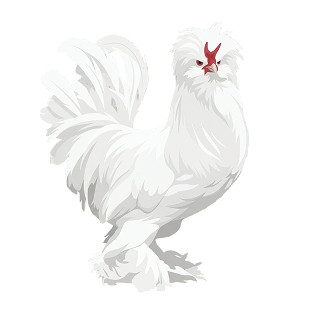

# KümesPro

### Kümes, kuluçka, satış ve finans takip sistemi

_Kümesindeki her hayvanı, her kuluçkayı, her satışı ve her kuruşu tek yerden takip et._

&nbsp;

&nbsp;

🌐 **[kamilsaim.web.app](https://kamilsaim.web.app)** &nbsp;·&nbsp; 🔁 Yedek: [kayserisustavuklari.github.io/kumespro](https://kayserisustavuklari.github.io/kumespro/)

---

## 🐔 KümesPro nedir?

KümesPro; güvercin, tavuk, hindi, kaz, bıldırcın, keklik, tavus kuşu gibi kanatlı yetiştiren üreticiler için hazırlanmış bir kümes yönetim uygulaması. Kaç kümesin var, her kümeste hangi ırktan kaç erkek/dişi hayvan olduğu, hangi kuluçkanın kaçıncı gününde olduğu, hangi civciv partisinden kaç tanenin satıldığı — hepsi tek ekranda.

Defter tutmak yerine telefonundan birkaç dokunuşla kaydet, uygulama senin için toplamları, verim yüzdelerini ve kâr/zarar hesabını çıkarsın. Veriler buluta (Supabase) kaydedildiği için telefon değişse, uygulama silinse de veriler kaybolmaz; Google hesabınla giriş yapan herkes sadece kendi verisini görür.

## 🚀 Nasıl çalışır?

1. **Kümes oluştur** — kümes adını, türünü ve ırklarını gir, erkek/dişi sayılarını gir
2. **Kuluçkaya başlat** — hangi kümeslerden yumurta aldığını, kaç yumurta koyduğunu kaydet; uygulama gün sayacını otomatik işletir
3. **Çıkım kaydet** — kuluçka bitince çıkan/boş/ölü sayılarını gir, verim yüzdesi otomatik hesaplanır; çıkan civcivler istersen doğrudan civciv ünitesine aktarılır
4. **Satış ve gider işle** — satılan hayvan/civciv/yumurdayı ve yem/ilaç/enerji giderlerini kaydet, kısmi ödemeleri takip et
5. **Sezon sonunda arşivle** — tek tıkla mevcut sezonu arşivle, yeni sezona sıfırdan başla; eski sezonlara istediğin zaman geri dönüp bakabilirsin

## ✨ Öne çıkan özellikler

|  |  |
|---|---|
| 🏠 **Sınırsız kümes yönetimi** | Her kümeste birden fazla ırk/grup, erkek/dişi ayrımı, giriş/çıkış geçmişi |
| 🥚 **Kuluçka takibi** | Çoklu yumurta kaynağı, otomatik gün sayacı, tür bazlı süre (güvercin, tavuk, bıldırcın, keklik, tavus...), çıkım sonuçları ve verim yüzdesi |
| 🐣 **Civciv/yavru ünitesi** | Parti bazlı ekleme/çıkarma, tam hareket geçmişi, kalan adet takibi; yaşı gelen hayvanları tek tıkla erkek/dişi ayrımıyla kümese aktar |
| 💰 **Satış modülü** | Tek satışta karışık ürün, **ırk seçerek hayvan satışı**, kısmi ödeme ve kalan borç takibi, tek tıkla "alındı"; alacaklar müşteri bazlı kartlarda |
| 📊 **Finans takibi** | Kategorili gider kaydı, kümes bazlı raporlama, otomatik net kâr/zarar |
| 🌱 **Sezon arşivi** | Sezonu anlık görüntüyle arşivle, geçmiş sezonları istediğin zaman incele |
| ☁️ **Bulut & güvenlik** | Google ile giriş, JSON yedek alma/geri yükleme, çevrimdışı çalışan PWA |
| 📱 **Her yerde çalışır** | Tarayıcıdan, ana ekrana kurulu PWA olarak veya Android APK olarak |

## 🛠 Teknoloji

Vanilla JavaScript ile yazılmış, build aracı gerektirmeyen tek dosyalık bir web uygulaması; veritabanı ve kimlik doğrulama için [Supabase](https://supabase.com) kullanır, **[kamilsaim.web.app](https://kamilsaim.web.app)** ([Firebase Hosting](https://firebase.google.com/products/hosting)) üzerinden yayınlanır. Aynı kod tabanı [Capacitor](https://capacitorjs.com) ile paketlenerek Android APK olarak da çalışır.

## 🕘 Sürüm Geçmişi

| Sürüm | Öne çıkanlar |
|-------|--------------|
| **7.3** | Satışta hayvan seçince kümesteki **ırk seçimi** — stok kontrolü ve stok düşümü artık seçilen ırka göre yapılıyor |
| **7.2** | Üniteden kümese aktarım (erkek/dişi ayrımı ve ırk seçimiyle), alacaklarda müşteri bazlı kişi kartları, yeni logo ve %85 küçülen sayfa boyutu |
| **7.1** | Android APK desteği eklendi (Capacitor ile kabuk APK, Google girişi için sistem tarayıcısı yönlendirmesi) |
| **7.0** | Civciv ünitesi parti bazlı düzenleme/silme/çıkarma, ünite-parti toplam senkronizasyonu, uygulama içi güncelleme bildirimi |
| **6.7** | Tavus kuşu kuluçkası eklendi (28 gün) |
| **6.5** | Excel/CSV rapor aktarımı ve kısmi ödeme (kalan borç) takibi eklendi |

## 🤝 Katkı

Uygulamaya gir, Google hesabınla giriş yap — kendi verilerin sadece sana ait olacak şekilde hemen kullanmaya başlayabilirsin.

---

🐔 KümesPro — kümesini büyütürken hesabını da büyüt

